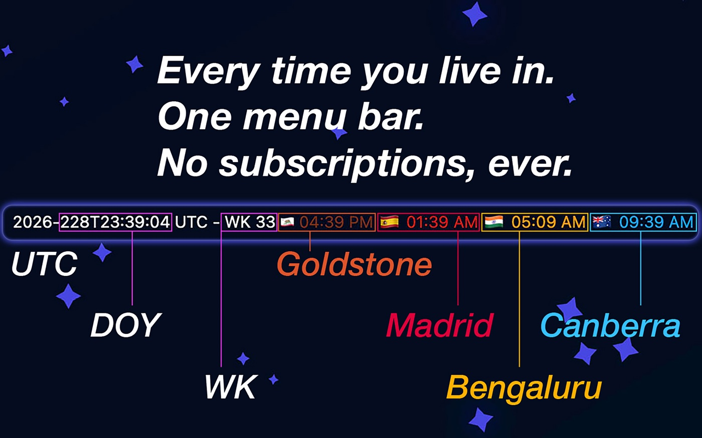
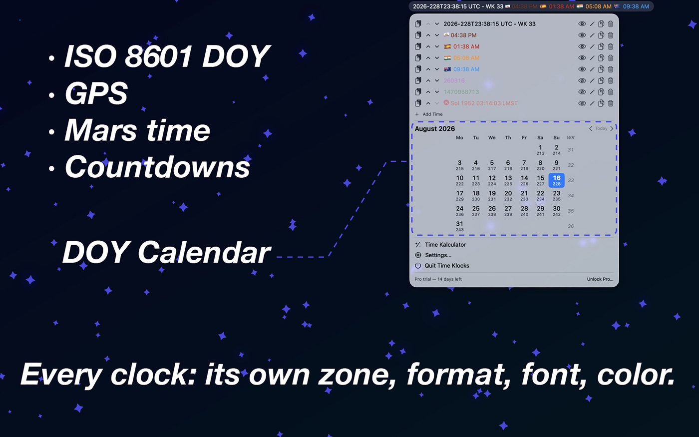
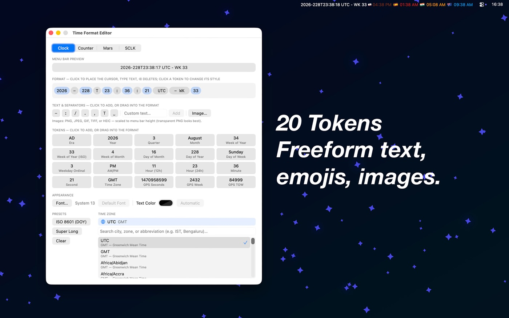
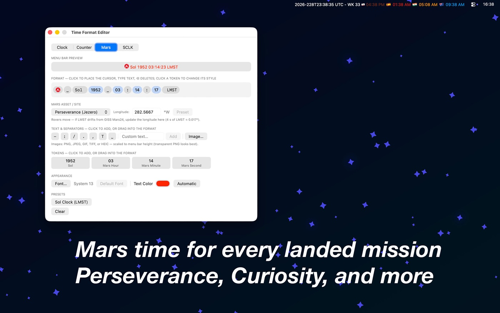
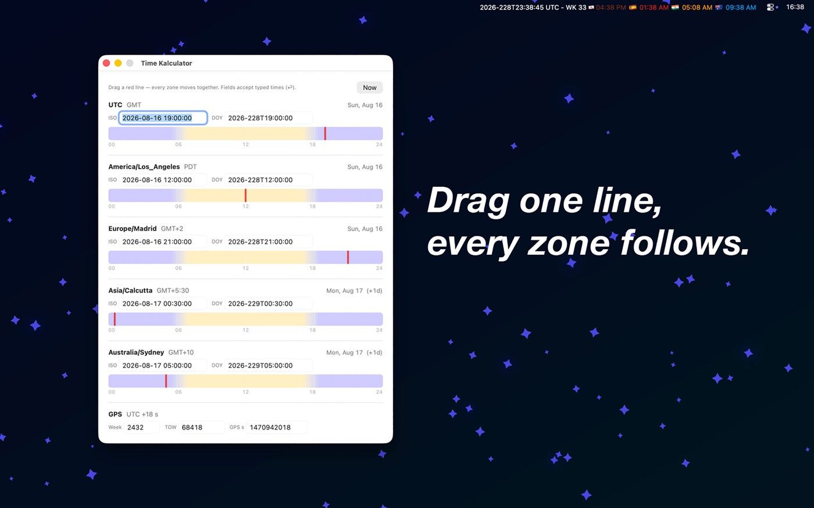

# Time Klocks

**The menu bar clock for people who work in more than one time.**

UTC and local. IST and PDT. Day-of-year timestamps. GPS weeks. Even Mars
time. Each clock in exactly the format, font, and color you want — side
by side in your Mac's menu bar.

**[Download on the Mac App Store](APP_STORE_LINK_HERE)** · One-time
purchase, no subscription · Requires macOS 26

---

## Quick start

1. **Click the clock** in your menu bar — that's the whole app. Times on
   top, calendar below, everything else one click deeper. (A fresh
   install starts you with three example clocks: your local time, UTC in
   day-of-year form, and Perseverance's sol clock waiting in the list.)
2. **Edit a format**: click ✏️ next to any time. Drag tokens into the
   format line, or just click in it and type — text you type stays text,
   tokens come from the palette. Click any token to cycle its style.
3. **Add clocks** with ➕ (or duplicate one), reorder with the arrows,
   show/hide with the eye, copy any timestamp with one click. The menu
   bar mirrors the list, top to bottom.
4. **Convert times**: open the Time Kalculator and drag any red line —
   every zone (and the GPS row) moves together. Fields accept typed ISO,
   DOY, or GPS values, down to the second.
5. **Make it yours**: per-clock font and color (Appearance section of the
   editor), separator between clocks (Settings), Sunday/Monday weeks.
6. **Share it**: Settings → Configuration exports your whole setup as a
   `.timeklocks` file — formats, fonts, colors, images, everything — for
   a colleague to import. Standardize a team on one set of clocks.

Want more detail? **[Read the guide →](guide.html)** — twelve short
"how do I…" sections, from your first clock to spacecraft clock kernels.

## The space stuff

- **Counters** — count down to (or up from) any moment, launch-clock
  style: T− becomes T+ at zero. Zero point in any time zone, DOY entry
  supported.
- **Mars time** — sol number and Local Mean Solar Time for Perseverance,
  Curiosity, InSight, Zhurong, and the historic landers, via the NASA
  GISS **Mars24** algorithm (Allison & McEwen 2000). Rovers drive;
  a longitude field lets you match JPL's current traverse data.
- **Spacecraft clocks (SCLK)** — import a mission's real NAIF SCLKSCET
  `.tsc` kernel (find them on the
  [NAIF site](https://naif.jpl.nasa.gov/pub/naif/)) for mission-grade
  SCLK readout. No SPICE installation required.
- **GPS time** — GPS week (full or mod-1024), time-of-week, and
  continuous GPS seconds. The GPS−UTC leap-second offset is verified
  monthly against the IETF leap-second list.

## FAQ

**How does the free version work?**
Everything is free for 14 days. After that you keep two fully custom
clocks forever; Time Klocks Pro (one-time purchase) unlocks unlimited
clocks and the Time Kalculator. No subscription, no account.

**Why does my time zone show "GMT+5:30" instead of "IST"?**
Apple's locale data only uses some abbreviations in matching regions.
Use the timezone token's **ABBR** style, or type the abbreviation you
want as literal text — the format editor makes that a two-second fix.

**How accurate is Mars time?**
Within a second of NASA's Mars24 tool. For rovers, small drifts vs. JPL
tools reflect the rover having driven since our stored site longitude —
update it in the Mars tab (4 s of LMST ≈ 0.017° of longitude).

**Where do I get an SCLK kernel?**
Your mission's ops team, or publicly from NAIF: look under
`naif.jpl.nasa.gov/pub/naif/<MISSION>/kernels/sclk/`, grab the newest
`.tsc`, and import it in the editor's SCLK tab.

**My clocks disappeared from the menu bar!**
macOS hides menu bar items when the bar is full — common on 13–14-inch
laptops with lots of icons. Time Klocks notices and shows a small
**⚠︎ clock icon** instead; click it and the panel tells you how to make
room (hide a clock with the eye, shorten a format, or ⌘-drag other
icons off the bar). The clocks return by themselves once they fit. Can't
see even the icon? **Launch Time Klocks again** — launching the running
app always opens its window.

**How do I share my clocks with a colleague?**
Settings → Configuration → **Export Clocks…** makes a `.timeklocks`
file with your entire setup. They pick **Import Clocks…** and choose
Append (adds to their list) or Replace (adopts yours wholesale).

**How do I reset to a clean install?**
Quit the app, then in Terminal: `defaults delete com.tk.TimeKlocks`.
The next launch is a fresh start (welcome window, starter clocks) —
export first if you want your setup back.

**How do updates work?**
Through the App Store, like any Mac app — automatically if you have
automatic updates on. A running menu bar app picks up an installed
update after you quit and relaunch it. Settings → Pro & About →
**Check for Updates…** opens the App Store's Updates page.

**Does Time Klocks phone home?**
No. The only network request the app ever makes is a monthly fetch of
the public IETF leap-second list. No analytics, no accounts, no data
collected — see the [privacy policy](privacy.html).

**Something's wrong / I have an idea.**
Email **spacenewt@icloud.com** — bug reports with a screenshot of the
format involved get fixed fastest.

---

© 2026 Teerapat Khanampornpan · [Guide](guide.html) · [Privacy](privacy.html)
